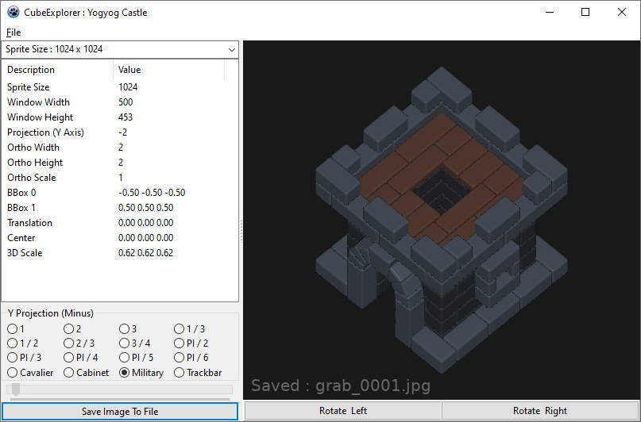

# CubeExplorer

This is a Lazarus LCL project

# Notes

The Cavalier, Cabinet and Military options are currently placeholders that do a (-1, -2, -1) viewpoint

# Attribution

Most models via Quaternius https://quaternius.com/ from the Medieval Village Pack

Medieval Fantasy Book via https://sketchfab.com/3d-models/medieval-fantasy-book-06d5a80a04fc4c5ab552759e9a97d91a by Pixel as a more complex example

YogYog Castle model via https://www.youtube.com/watch?v=IFr0NIzDges - the model itself was part of a blend without a license. The gltf here is just the base model for comparison with the YogYog piece.